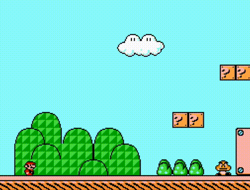

[See it live](https://mario.js.jeremiahkellick.com/)

# Mario.js

This is a clone of the first level of Super Mario Bros. 3 written in JavaScript.

## Gameplay

## What to look at

Here's the code for what I consider to be the three most interesting problems
from this project

- [Parsing Tiled Map Editor's output](src/game-objects/loadTilemap.js)
- [Collision detection](src/components/Collider.js)
- [Character movement](src/components/Movement.js)
