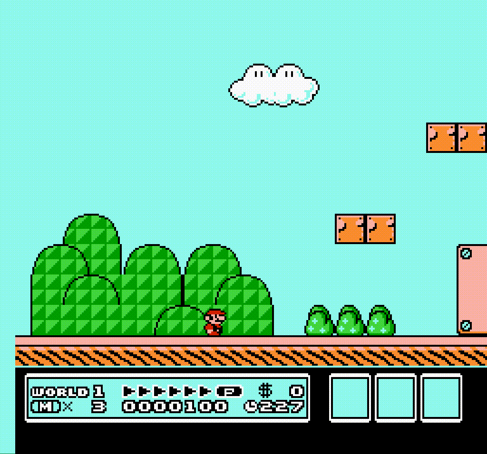
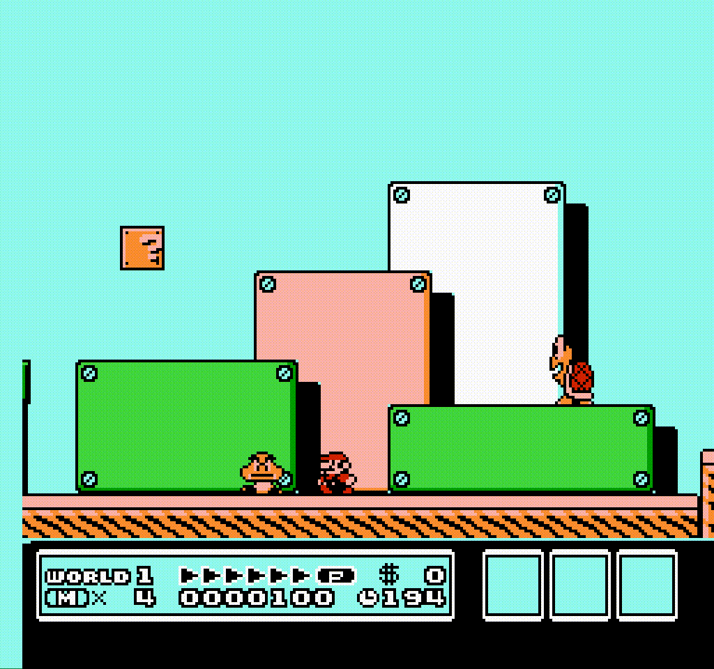
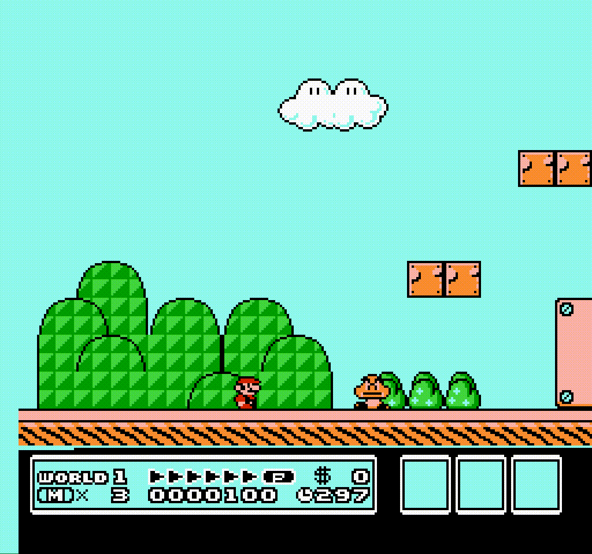
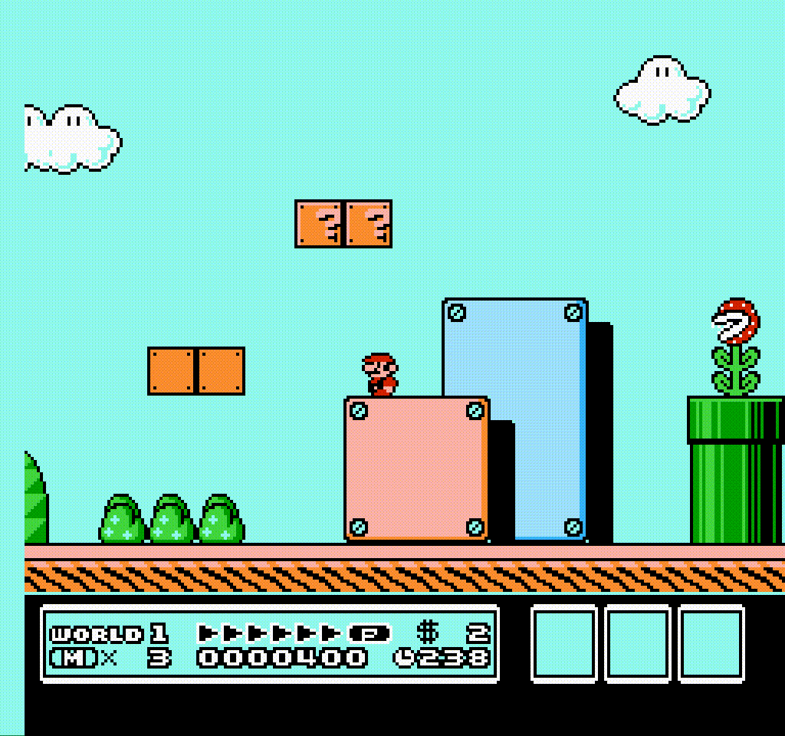

# Super Mario Bros. 3

A clone of the first level of Super Mario Bros. 3 written in JavaScript.

## Features

### MVP

- Moving and jumping
- Goombas
- Taking damage from running into enemies
- Destroying enemies by jumping on them
- Mushroom power-up

### Bonus

- Piranha plants
- Koopas
- Picking up and throwing shells
- Super leaf power-up
- Running
- Long jump

## Architecture

The code will follow a component-based design similar to Unity's. Nearly
everthing in the game will be represented as game objects. A game object will
just be a generic container will little built in functionality. Functionality
will mainly be added through various components.

Mario, for example, might have these components:

- Input - responsible for getting input from the keyboard
- Movement - responsible for moving Mario around
- Health - responsible for keeping track of how many hits Mario can take

Each component will be able to define certain lifecycle methods in order to take
action at certain times in the game. Lifecycle methods I plan to add:

- `start()` - called before the component's first update
- `update()` - called every frame
- `onDestroy()` - called right before component's game object is destroyed

## Technologies

Only vanilla HTML, CSS, and JavaScript will be used to build the game

## Implementation Timeline

### Monday

- [ ] Set up the game architecture
- [ ] Draw Mario and the ground on screen

### Tuesday

- [ ] Basic movement and collision
- [ ] Mario animation

### Wednesday

- [ ] Goomba movement and animation
- [ ] Dying and restarting
- [ ] Destroying enemies by jumping on them

### Thursday

- [ ] Basic level editing

### Friday

- [ ] Mushroom power-up
- [ ] Piranha plants
- [ ] Koopas

### Saturday

- [ ] Picking up and throwing shells
- [ ] Super leaf power-up
- [ ] Running
- [ ] Long jump

### Sunday

- [ ] Mapping out level 1
- [ ] Winning

## Wireframes

### Moving

### Dying

### Destroying enemies

### Powering up

